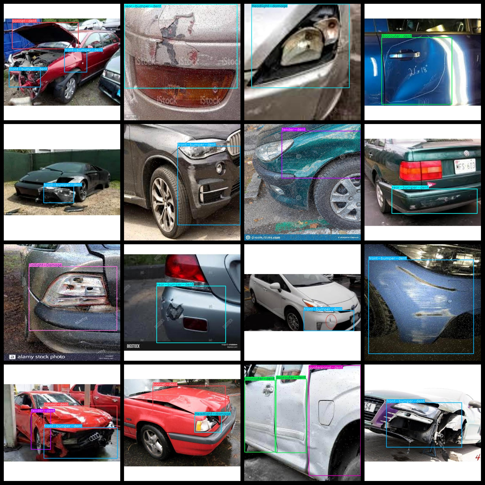
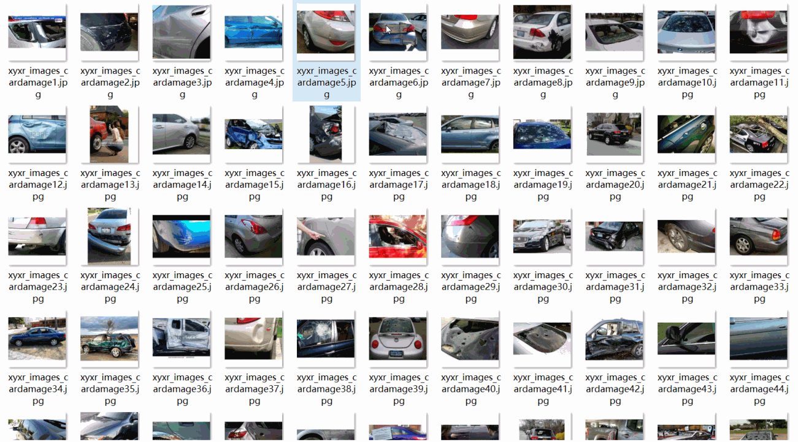

# [Object Detection] Sedan Vehicle Body Defect Detection Dataset - 6957 images with YOLO+VOC (Augmented)

The dataset format includes both VOC and YOLO formats. It consists of three folders: JPEGImages, Annotations, and labels. The JPEGImages folder contains a total of 6957 jpg images, the Annotations folder has 6957 xml files, and the labels folder has 6957 txt files. There are a total of 14 label types: "Front-windscreen-damage", "Headlight-damage", "Rear-windscreen-Damage", "Runningboard-Damage", "Sidemirror-Damage", "Taillight-Damage", "bonnet-dent", "boot-dent", "doorouter-dent", "fender-dent", "front-bumper-dent", "quaterpanel-dent", and "rear-bumper-dent".

Each label type has a specific number of boxes (the yolo format class order does not match this, but is based on the classes.txt in the labels folder):

- Front-windscreen-damage boxes = 293
- Headlight-damage boxes = 664
- Rear-windscreen-Damage boxes = 458
- Runningboard-Damage boxes = 347
- Sidemirror-Damage boxes = 283
- Taillight-Damage boxes = 449
- bonnet-dent boxes = 1256
- boot-dent boxes = 167
- doorouter-dent boxes = 1599
- fender-dent boxes = 1041
- front-bumper-dent boxes = 1913
- quaterpanel-dent boxes = 841
- rear-bumper-dent boxes = 1060
- roof-dent boxes = 398

Total box count = 10769

The image resolution is clear.

Image enhancement is enabled.

Label shapes are rectangular boxes for target detection recognition.

Important Note: No guarantees are made regarding the accuracy or weights of the trained models using this dataset. The dataset is provided for accurate and reasonable annotations only.

Overview of Images:

## Images

---

Here is a pay link on Stripe (https://buy.stripe.com/3cs8yP7sY87d0vu9AB). Please contact me lonlonago@foxmail.com after funding $89, and I will send you a complete data files, thank you!

